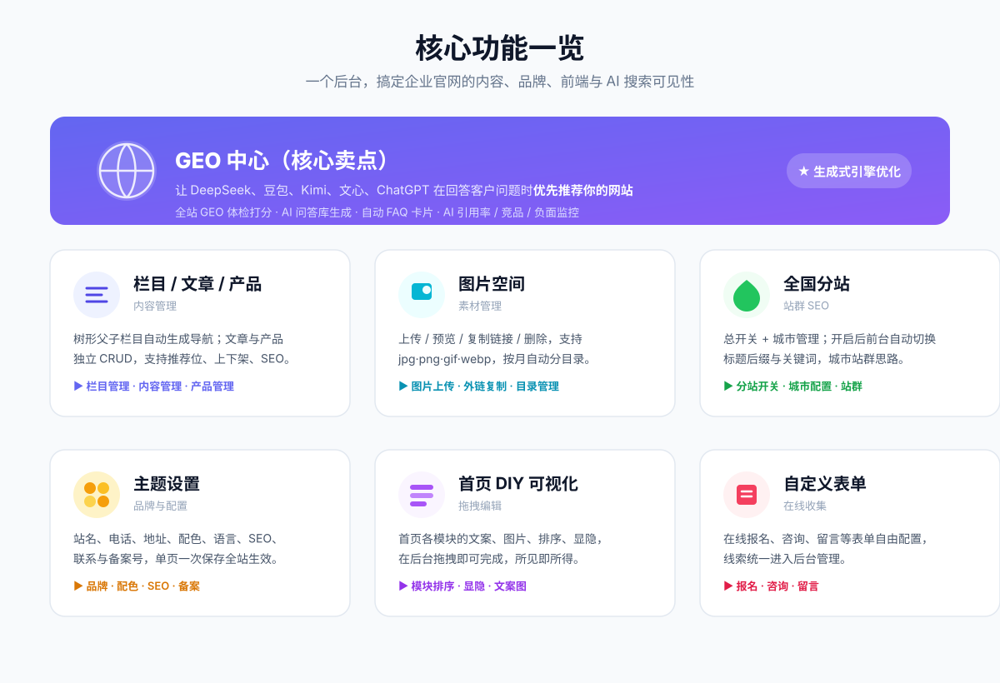
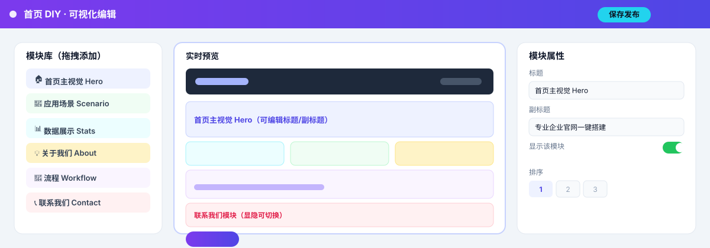

# 得应盯 · 企业官网 CMS 建站系统

> 一个后台，管理整站内容、品牌与前端展示 —— 栏目/文章/产品、图片空间、全国分站、主题设置、首页可视化编辑，零框架依赖、宝塔一键部署。


---

## ✨ 核心功能



| 功能 | 能做什么 |
| --- | --- |
| **栏目 / 文章 / 产品** | 树形父子栏目自动生成导航；文章与产品独立管理，支持推荐位、上下架、篇级 SEO |
| **图片空间** | 上传 / 预览 / 复制外链 / 删除，支持 jpg·png·gif·webp，按月自动分目录 |
| **全国分站** | 总开关 + 城市管理；开启后前台自动切换标题后缀与关键词，城市站群 SEO 思路 |
| **主题设置** | 站名、电话、地址、配色、语言、SEO、联系与备案号，单页一次保存全站生效 |
| **首页 DIY 可视化** | 首页各模块的文案、图片、排序、显隐，后台拖拽即可完成，所见即所得 |
| **自定义表单** | 在线报名、咨询、留言等表单自由配置，线索统一进入后台 |

---

## 🎨 首页 DIY 可视化编辑

首页不是写死在模板里的。各个模块（主视觉、场景、数据、关于、流程、CTA、联系）的**文案、图片、排序、显隐**，都在后台拖拽完成，实时预览、保存即生效。



- 左侧「模块库」：把需要的模块拖到页面
- 中间「实时预览」：所见即所得
- 右侧「模块属性」：改标题、副标题、开关显示、调整排序

---

## 🚀 快速部署（宝塔 · 安装向导）

1. **上传**：整个 `deyingding-php` 目录传到站点根目录（无需改任何代码）
2. **访问**：浏览器打开 `http://你的域名/` → 自动跳转安装向导（或直接访问 `/install/index.php`）
3. **填表**：按向导填数据库地址 / 库名 / 账号 / 密码 + 设置管理员账号密码
4. **完成**：自动建库、建表、写 `config.php`、创建管理员 → 点击「进入后台」

> 环境要求：PHP 8.0+（推荐 8.2 / 8.3），MySQL 5.7+。安装向导会自动检测环境，不满足会明确提示。
> 安全提示：安装完成后建议删除服务器上的 `install` 目录（有 `install.lock` 保护，不删也能用，但删掉更安全）。
> 重新安装：删除服务器根目录的 `install.lock`，再访问 `/install/index.php`。

---

## 📁 目录结构

```
deyingding-php/
├── index.php          # 前台入口（?act=home|list|detail|city，可选 ?city=）
├── admin.php          # 后台入口（?m=dashboard|categories|articles|products|uploads|citysites|settings|tpls）
├── install/index.php  # 网页安装向导（环境检测+填库+自动建表+写配置）
├── config.php         # 数据库配置（安装向导自动生成，已被 .gitignore 忽略，请勿提交）
├── database.sql       # 建库建表脚本（install 自动执行）
├── lib/
│   ├── db.php         # PDO 单例 + 查询助手（预处理防注入）
│   └── funcs.php      # 设置/导航树/分页/上传/登录校验等
├── static/            # 后台样式 + 前台样式 + 交互脚本
├── uploads/           # 图片空间目录（仅 .htaccess 入库，上传文件不入库）
├── views/             # 后台页面
├── tpl/               # 前台核心模板（layout/home/list/detail/city）
└── tpls/              # 可导入的界面模板（后台「模板中心」导入）
```

---

## 🗺️ 全国分站怎么用

1. 后台「全国分站」→ 开关选「开启」并保存
2. 添加城市，如：城市=保定、标题后缀=`- 保定分站`、关键词/描述填保定版
3. 前台任意页面加 `?city=保定` → 顶部出现分站生效提示，页面标题自动带后缀，关键词/描述切换为分站版
4. 首页导航自动出现「城市分站」入口

## 🔗 前台路由一览

```
index.php                      首页
index.php?act=list&cat=1       栏目列表（文章/产品自动识别）
index.php?act=detail&type=article&id=1   文章详情
index.php?act=detail&type=product&id=1   产品详情
index.php?act=city             城市分站列表
index.php?city=保定            分站模式（任意页面）
```

---

## 🧭 后续升级方向

- [ ] 富文本编辑器（后台正文，可接入 wangEditor CDN）
- [ ] 管理员密码修改
- [ ] 内容批量操作 / 回收站
- [ ] Redis 缓存 + 页面静态化
- [ ] **多站点 SaaS**（自助注册、子站生成、模板导入）
- [ ] 接入完整深色前端模板
- [ ] 前台在线报名 / 在线咨询表单

---

## 📦 第三方依赖

- **ECharts（图表可视化）**：后台「数据看板」使用 ECharts 渲染地域 / 访问图表。仓库不内置该库，请自行到 [Apache ECharts 官网](https://echarts.apache.org/) 下载 `echarts.min.js` 与 `china.js`，放入 `static/vendor/echarts/`；缺失时看板显示降级提示，不影响其他功能（[Apache-2.0](https://www.apache.org/licenses/LICENSE-2.0)）。
- 其余功能**零第三方 PHP / JS 依赖**，无需 Composer，开箱即用。

---

## 📄 开源协议

本项目采用 **[MIT 协议](./LICENSE)**（详见仓库根目录 `LICENSE` 文件）。可自由使用、修改、再分发，请保留版权声明。
